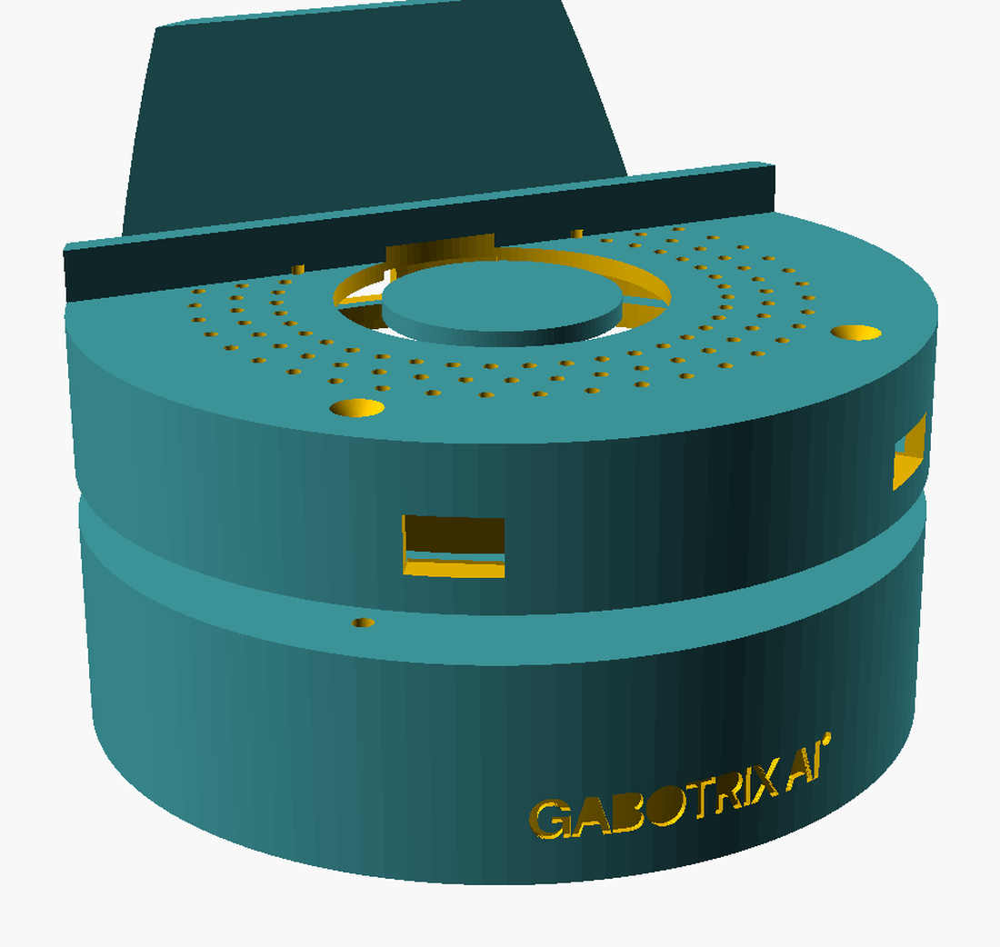
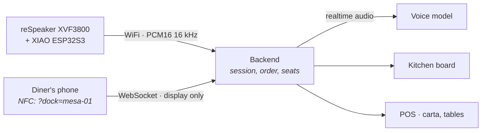
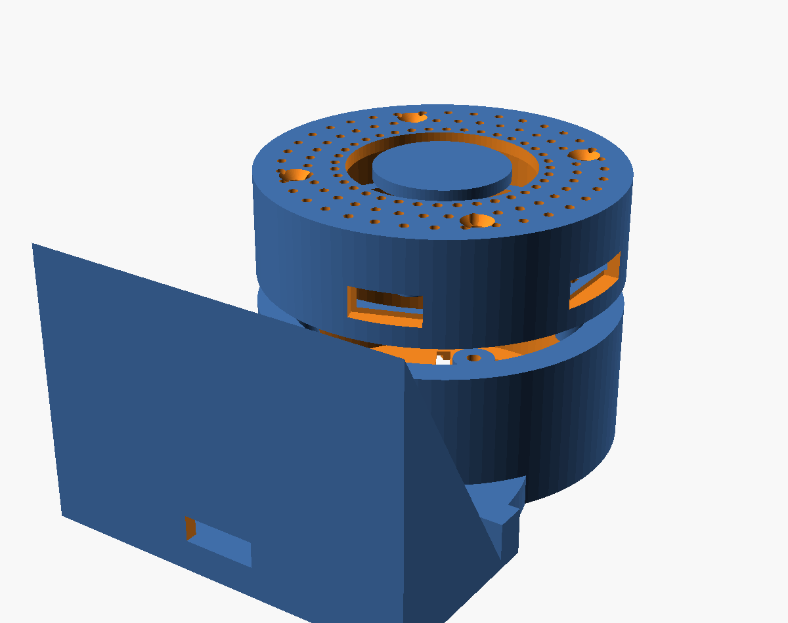

<div align="center">



# Mesero AI

**A voice waiter that lives in the table, not in the phone.**

Diners talk to the table. The gadget listens and answers.
Their phone only follows along — and never asks for a microphone.

[](LICENSE)
[](https://wiki.seeedstudio.com/respeaker_xvf3800_xiao_getting_started/)
[](firmware/)
[](backend/)

</div>

---

## The idea

A diner sits down, taps an NFC sticker on the table stand, and their phone opens
a screen bound to that table. From then on they simply **talk**. The order
appears on the screen as they say it, the kitchen sees it, the bill is paid from
the same page.

The interesting part is what the table hears. The reSpeaker's four-microphone
array reports the **direction** every phrase came from, so the agent knows *who
at the table is speaking* — and the ajiaco goes to the person who asked for it,
without anybody typing a seat number.

<div align="center">

</div>

## Why the phone never touches the hardware

This is the decision everything else follows from.

iOS Safari has neither Web Bluetooth nor Web Serial, so a phone cannot pair with
the gadget even if we wanted it to. It also drops microphone permission the
moment the screen locks, which makes phone-side capture useless for a device
sitting on a table for an hour.

So the two never talk to each other. Both open a plain WebSocket to the backend
and are matched by a `dock` id — which is exactly what the NFC tag encodes.



The tag is a passive NTAG213 sticker in the stand — no power, no pairing, and
every iPhone since the XS reads it natively. The board has no NFC and needs none.

## The firmware is deliberately dumb

It carries; it does not decide. It moves already-clean 16 kHz audio between I2S
and a WebSocket and reports the bearing. It does not know the menu, when a turn
ended, or which vendor answers.

That is on purpose, for four reasons: changing the menu must not mean unscrewing
a table; restarting a server takes a second where flashing and re-provisioning
take minutes; less code on the device is fewer failures somewhere with no serial
monitor attached; and the XMOS chip already does echo cancellation, beamforming
and noise suppression **in silicon**, so repeating it here would be slower and
worse.

## Quick start

You need the two Seeed boards, a speaker, and about twenty minutes.

```bash
git clone https://github.com/gabotrix/mesero-ai.git && cd mesero-ai
cd backend && npm install && node src/index.js
```

Open `http://localhost:8787/?dock=mesa-01` and you have the table screen,
running on the carta committed in `backend/menu.json`. No account, no keys, no
configuration — enough to hear the whole thing work before you decide anything.

To serve your own restaurant, create one in the console and set **one variable**:

```bash
VENUE_KEY=msr_live_…
```

Its carta, its tables and its agent arrive with it, and the backend caches them
to disk so a restaurant whose internet drops at seven in the evening still
serves dinner. That is the whole configuration — there is nothing else to set.

No hardware yet? `device-client/` is a Python stand-in that speaks the same
protocol using your laptop's microphone.

## Bill of materials

| Part | Why |
| --- | --- |
| [reSpeaker XVF3800 + XIAO ESP32S3](https://wiki.seeedstudio.com/respeaker_xvf3800_xiao_getting_started/) | Four-mic array with hardware AEC, beamforming and direction of arrival |
| 8 Ω speaker, 50 × 45 × 22 mm | Seeed 114993346 fits the printed bay exactly |
| NTAG213 sticker, 25 mm | Passive. Sits under the phone cradle |
| ~90 g PETG | The case. PLA warps in a kitchen |
| 4 × M3 × 12 screws | Lid to base |

## Build it

**1 · Print the case.** Parametric OpenSCAD in [`hardware/case/`](hardware/case/).

```bash
openscad -D 'part="base"' -o base.stl hardware/case/mesero-dock.scad
openscad -D 'part="lid"'  -o lid.stl  hardware/case/mesero-dock.scad
```

Print `calib.stl` first — it verifies the mount circle and the connector cutouts
before you commit four hours to the lid. PETG, 0.2 mm, 4 walls, 25% infill.

<div align="center">

</div>

**2 · Flash the firmware.**

```bash
cd firmware && pio run -t upload
```

On first boot it raises a WiFi portal named **MeseroAI-setup**. Join it from a
phone and the setup page asks for the network, the table id and the venue key —
or scan the QR the console prints for that table and every field arrives filled.

**3 · Run the backend.** Locally as above, or as a container:

```bash
docker compose -f deploy/cloud/docker-compose.yml up -d
```

See [`docs/servidor.md`](docs/servidor.md) for where it should live and why a
diner's mobile data settles the question.

## What is in here

| Path | What it is |
| --- | --- |
| [`docs/protocolo.md`](docs/protocolo.md) | **The contract.** Binary audio frames plus JSON control, implemented identically by the firmware and the desktop client |
| [`firmware/`](firmware/) | ESP32S3 firmware — I2S, WebSocket, LED ring, setup portal |
| [`backend/`](backend/) | Session bridge: device audio ⇄ model, order state, screen fan-out |
| [`web/`](web/) | Table screen, kitchen board and POS. Static, no build step |
| [`hardware/case/`](hardware/case/) | Parametric case and phone cradle |
| [`device-client/`](device-client/) | Python stand-in for the gadget |
| [`deploy/`](deploy/) | Container and appliance deployments |

## Design decisions worth knowing

Every one of these is a bug we shipped first.

**A turn ends when the speaker stops, not when the model does.** The backend
meters audio to the device at real time, so playback trails generation by the
length of the queue. Ending the turn at `turnComplete` opens the microphone while
the speaker is still talking — and the agent hears itself, answers itself, and
orders its own dinner.

**Barge-in is gated on the array's hardware VAD, not on level.** Measured echo
peaked at 22099 against speech at 32767; no threshold separates those reliably.
The XMOS chip already knows whether a human is talking, so ask it.

**Bearings are sampled while somebody speaks, never at tool-call time.** The
model answers seconds after a diner stops, by which point the azimuth register
holds something stale. Reading it there produced phantom customers sitting at
exactly 0° and exactly 90°.

**Every tuning constant is asserted numeric at boot.** Three of them were once
missing from the config, and `n >= undefined` is quietly `false` — so the
features simply switched themselves off with no error anywhere.

## License

Apache License 2.0 — see [LICENSE](LICENSE).

The hosted voice service that a venue key unlocks is operated by GABOTRIX and is
not part of this repository. Everything needed to build the device and run your
own server is.

<div align="center">
<sub>Built by <a href="https://gabotrix.com"><b>GABOTRIX</b></a> · OPENMARKT S.A.S.</sub>
</div>
